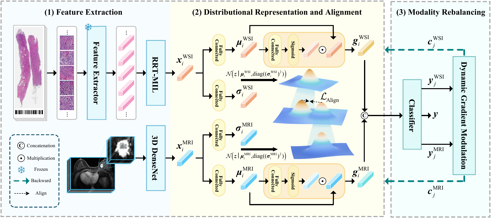

# Imbalance-Aware Distributional Alignment of Heterogeneous Modalities for HER2 Status Prediction

Official implementation of the MICCAI 2026 paper **Imbalance-Aware
Distributional Alignment of Heterogeneous Modalities for HER2 Status
Prediction**.





## Pre-Requisites

```bash
conda create -n iada python=3.9
conda activate iada
pip install -r requirements.txt
```

## Prepare Your Data

CSV files are expected to contain three columns:

```text
mri_id,wsi_id,label
```

Headerless CSV is used by default. Add `--csv_has_header` for headered CSV
files. Feature files can be addressed either by absolute paths in the CSV or by
IDs resolved under the supplied roots. The loader searches common suffixes:
`.pt`, `.pth`, `.h5`, `.hdf5`, `.npy`, and `.npz`.

Recommended directory structure:

```text
DATA_ROOT_DIR/
  wsi_features/
    slide_001.pt
    slide_002.pt
    ...
  mri_volumes/
    case_001.h5
    case_002.h5
    ...
LABEL_DIR/
  HER2_internal.csv
  HER2_external.csv
```

For each row in the CSV, `wsi_id` should resolve to a WSI feature bag and
`mri_id` should resolve to a 3D MRI volume.

## Internal 5-Fold Evaluation

```bash
CUDA_VISIBLE_DEVICES=<GPU_ID> python train_iada.py \
  --mode internal_5fold \
  --internal_csv <LABEL_DIR>/HER2_internal.csv \
  --wsi_root <DATA_ROOT_DIR>/wsi_features \
  --mri_root <DATA_ROOT_DIR>/mri_volumes \
  --output_dir <OUTPUT_DIR>/her2_internal5
```

## External Evaluation

Train on all internal data and evaluate on the external cohort:

```bash
CUDA_VISIBLE_DEVICES=<GPU_ID> python train_iada.py \
  --mode external \
  --internal_csv <LABEL_DIR>/HER2_internal.csv \
  --external_csv <LABEL_DIR>/HER2_external.csv \
  --wsi_root <DATA_ROOT_DIR>/wsi_features \
  --mri_root <DATA_ROOT_DIR>/mri_volumes \
  --output_dir <OUTPUT_DIR>/her2_external
```

You can also start from the template config:

```bash
python train_iada.py --config configs/her2_iada.yaml
```

Replace all placeholder paths in the config before running full experiments.


## Citation

If you find this repository useful, please cite:

```bibtex
@inproceedings{IADA2026,
  title     = {Imbalance-Aware Distributional Alignment of Heterogeneous Modalities for HER2 Status Prediction},
  author    = {Anonymous},
  booktitle = {International Conference on Medical Image Computing and Computer-Assisted Intervention (MICCAI)},
  year      = {2026}
}
```

